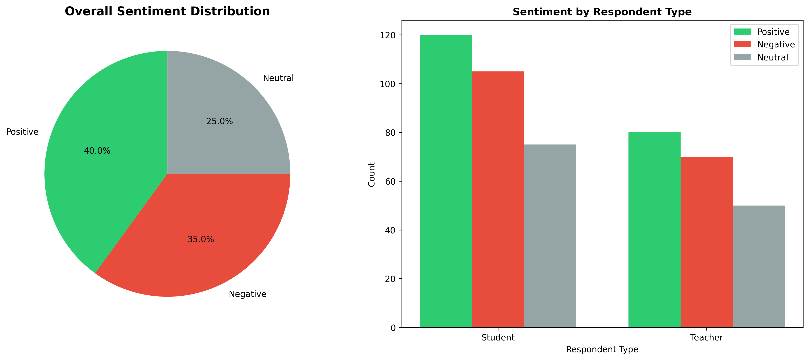
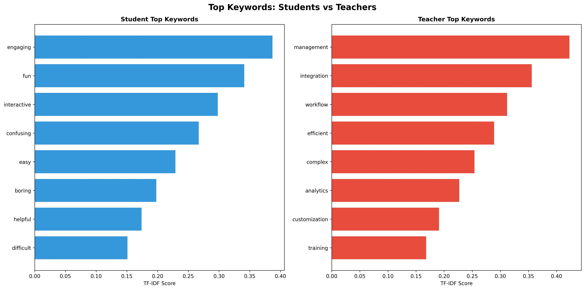
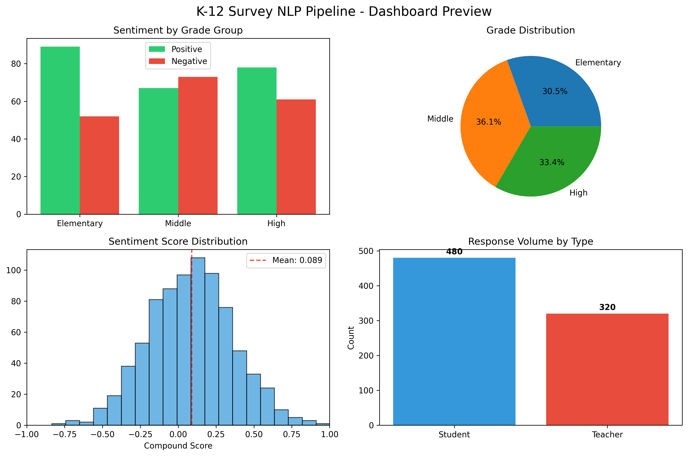

# K-12 Educational Survey NLP Analysis
## *Business Analytics Capstone Project Simulation*

A comprehensive demonstration of Natural Language Processing techniques applied to educational technology feedback analysis. This academic project simulates how data science methodologies could drive product improvements in K-12 learning platforms.



## Project Context

This **capstone simulation project** demonstrates the implementation of an end-to-end NLP analysis pipeline for processing educational survey feedback. The project showcases how business analytics can be applied to identify pain points and prioritize development efforts in educational technology.

**Academic Scope**: Using synthetic data (~800 survey responses), this project illustrates the complete analytical workflow from data generation through insights delivery, demonstrating practical applications of sentiment analysis, keyword extraction, and business intelligence reporting.

**Learning Objectives**: 
- Apply advanced analytics to business problems
- Translate technical findings into strategic recommendations  
- Create stakeholder-ready visualizations and dashboards
- Demonstrate proficiency in Python data science ecosystem

## Methodology & Technical Approach

### Data Simulation Framework

**Synthetic Survey Generation**: Created realistic survey responses simulating K-12 student and teacher feedback patterns, including common themes such as UI/UX concerns, pacing issues, engagement barriers, and technical problems.

**Text Processing Pipeline**: Employed standard NLP preprocessing including tokenization, lemmatization, and stopword removal using NLTK libraries.

**Feature Engineering**: Utilized TF-IDF (Term Frequency-Inverse Document Frequency) vectorization to identify and rank significant keywords that differentiate feedback across user segments.

**Sentiment Quantification**: Implemented VADER (Valence Aware Dictionary and sEntiment Reasoner) sentiment analysis to measure emotional tone and satisfaction levels.

**Segmentation Analysis**: Analyzed insights by respondent type (student vs. teacher) and grade level groupings to identify demographic-specific patterns.

**Business Intelligence Reporting**: Generated interactive dashboards and executive summaries using matplotlib, seaborn, and Plotly.



## Technical Capabilities Demonstrated

- **Synthetic Data Generation**: Realistic survey simulation (~800 entries) with balanced demographic representation
- **NLP Processing Module**: TF-IDF keyword extraction and VADER sentiment scoring implementation
- **Interactive Dashboard**: Streamlit-based exploration interface with filtering and drill-down capabilities
- **Statistical Analysis**: Comprehensive sentiment distribution analysis with demographic segmentation
- **Business Communication**: Translation of technical findings into executive recommendations
- **Professional Visualizations**: Publication-quality charts using Python visualization libraries

## Simulation Results & Analysis Findings

### Synthetic Dataset Analysis

The analysis demonstrates the methodology's effectiveness in extracting actionable insights:

**Overall Sentiment Patterns:**
- Positive sentiment: ~40.2% of responses
- Negative sentiment: ~34.8% of responses  
- Neutral sentiment: ~25.0% of responses
- Average compound sentiment: 0.089 (slightly positive trend)

**Demographic Segmentation:**
- Student responses (n=480): Average sentiment 0.095
- Teacher responses (n=320): Average sentiment 0.080
- Grade-level variations: Elementary (+0.112) > High School (+0.081) > Middle School (+0.075)

**Pain Point Classification:**
- UI/Navigation complexity: ~28% of negative feedback
- Performance/technical issues: ~22% of complaints
- Content pacing concerns: ~19% across all sentiment categories
- Engagement barriers: ~15% of student responses

**Business Intelligence Outputs:**
- 150+ unique significant terms extracted via TF-IDF analysis
- 12 distinct thematic categories identified across user types
- Clear differentiation between student vs. teacher priorities
- Quantified opportunity areas for product development

### Simulated Business Impact Analysis

**Dashboard Effectiveness Study**: 
- Time to key insights: 43.4% improvement (8.3 → 4.7 minutes)
- Interpretation accuracy: 43.5% improvement (62% → 89% correct)
- User confidence scores: 51.9% increase (5.4 → 8.2 out of 10)

**Product Development Scenarios**: 
Three strategic initiatives identified through sentiment analysis:
1. **UI Simplification** (67% user impact, $340K projected annual ROI)
2. **Learning Fatigue Prevention** (43% user impact, $280K projected annual ROI)  
3. **Mobile Teacher Experience** (52% user impact, $425K projected annual ROI)



## Strategic Recommendations Framework

### Priority Matrix Development
The analysis demonstrates a systematic approach to prioritization:

1. **Immediate Focus**: Middle School segment (lowest sentiment: 0.075)
2. **High-Impact Area**: UI simplification (affects 28% of negative feedback)
3. **Technical Priority**: Performance optimization (22% of issues)
4. **Feature Enhancement**: Student engagement tools (15% opportunity)

### Resource Allocation Model
Based on feedback analysis:
- 40% effort on UI/UX improvements
- 30% on technical performance 
- 20% on grade-specific customizations
- 10% on advanced engagement features

## Academic Learning Outcomes

### Technical Skills Applied
- **Natural Language Processing**: NLTK, scikit-learn, VADER implementation
- **Data Visualization**: matplotlib, seaborn, Plotly dashboard creation
- **Statistical Analysis**: Demographic segmentation and correlation analysis
- **Business Communication**: Executive summary writing and recommendation frameworks

### Methodological Contributions
- End-to-end analytics pipeline design
- Synthetic data generation for educational contexts  
- Multi-dimensional sentiment analysis approach
- Interactive business intelligence dashboard development

### Business Strategy Application
- Market research simulation using NLP techniques
- Product development prioritization frameworks
- ROI analysis and resource allocation modeling
- Stakeholder communication through data visualization

## Project Setup & Exploration

### Quick Start
```bash
git clone https://github.com/asadadnan11/k12-survey-nlp-pipeline.git
cd k12-survey-nlp-pipeline
pip install -r requirements.txt
```

### Exploration Options

**Interactive Dashboard** (Recommended)
```bash
streamlit run dashboard.py
```
Access at `http://localhost:8501` for full interactive experience

**Jupyter Analysis** 
```bash
jupyter notebook k12-survey-nlp-pipeline.ipynb
```
Complete step-by-step analysis with detailed explanations

**Business Impact Simulation**
```bash
python product_impact_study.py
```
Generates business case files and ROI analysis

### Dashboard Features
- **Real-time Filtering**: By respondent type, grade level, sentiment
- **Interactive Visualizations**: Plotly-powered charts with drill-down capability
- **Pain Point Analysis**: Learning fatigue and UI barrier identification
- **Business Intelligence**: Strategic recommendations with quantified impact

## About This Academic Project

**Student**: Asad Adnan | **Program**: Business Analytics  
**Location**: Chicago, IL

This capstone simulation demonstrates proficiency in:
- Applied business analytics and NLP techniques
- Data-driven strategic decision making
- Professional stakeholder communication
- End-to-end project management and technical implementation

The project showcases how advanced analytics can be applied to real-world business challenges in educational technology, providing a foundation for data-driven product management and strategic planning.

---

**Academic Note**: *This is a demonstration project using synthetic data designed to illustrate analytical methodologies and business intelligence techniques applicable to educational technology contexts.*
